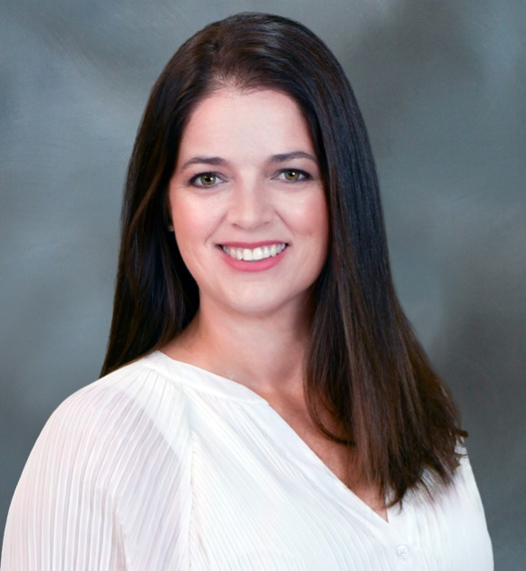
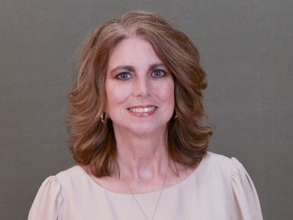
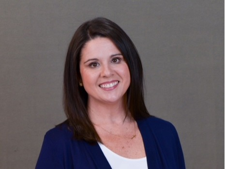

[Skip to content](#main-content)

Our Team

# Meet Your Pell City Insurance Partner

At The Brooke Tollison Agency, insurance is about relationships — not transactions. We are your neighbors, and we are here for the long term.

CICCRMAIC

## Brooke Tollison

Agency Owner — Alfa Insurance Independent Exclusive Agent

After serving Pell City as an Alfa insurance agent since 2017, Brooke founded The Brooke Tollison Agency, Inc. in December 2025 to offer an even greater level of personalized service through Alfa insurance. She holds three advanced professional designations — CIC, CRM, and AIC — representing hundreds of hours of coursework across commercial, personal, risk management, and claims disciplines.

> “For generations, my family has received exceptional service from Alfa. My grandfather, Ernest Hayes, became a Farm Bureau member in the 1970s, and my parents have been insured with Alfa for as long as I can remember.”

A 21-year resident of Pell City, Brooke and her husband Jim are raising their family in the same community she serves — as a Rotary board member, Finance Committee Chairperson at Pell City First Baptist, and sponsor of local conservation efforts.

[View Credentials & Awards](/expertise)

## Leslie Layton

Associate Agent

Leslie grew up in Pell City and has called Ragland home for more than 30 years. She and her husband are the proud parents of Bronson Layton. With 30 years of experience serving Alfa clients, Leslie brings institutional knowledge and a personal touch that clients have relied on for decades.

## Misty Jordan

Associate Agent

Misty has lived in Pell City for over 15 years. She and her husband Nathan are the parents of Charis and Pierson Jordan and are active members of New Hope Baptist Church, where Misty serves as Director of the local Food Ministry. Her deep community roots are a natural extension of the agency's values.

## Ready to work with a team that knows you by name?

Your local insurance agency for Pell City, Riverside, Ragland, Ashville, Springville, Odenville and the rest of St. Clair County, plus Talladega, Calhoun, Shelby Counties and all of Alabama.

[Get in Touch](/contact) [Our Services](/services)